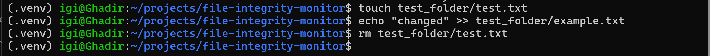
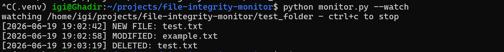

# file-integrity-monitor

A Python tool that watches a directory and detects when files are created, modified, or deleted using SHA-256 hashing to catch any changes at the byte level. It runs in two modes: a one-off integrity check against a saved baseline, or a real-time watcher that alerts you the moment something changes.

I built this as a solo project to get hands-on with some concepts from my security modules, specifically how file integrity monitoring actually works under the hood (it's basically what tools like Tripwire do).

---

## how it works

When you create a baseline, the tool walks the target directory, hashes every file with SHA-256, and saves the results to `baseline.json`. When you run a check (or have the watcher running), it compares the current state against that snapshot and flags anything that's changed.

- **new file** → hash exists now but not in the baseline  
- **modified file** → hash exists in both but they don't match  
- **deleted file** → hash was in the baseline but the file is gone  

All alerts get timestamped and written to `logs/alerts.log`.

The real-time watcher uses [watchdog](https://github.com/gorakhargosh/watchdog) to listen for filesystem events rather than polling, so it reacts instantly instead of running on a timer.

---

## project structure

```
file-integrity-monitor/
├── monitor.py          # hashing, baseline management, integrity checks
├── watcher.py          # real-time watchdog event handler
├── config.py           # paths (monitor dir, baseline file, log file)
├── requirements.txt
├── logs/
│   └── alerts.log
└── test_folder/        # the directory being monitored
    └── example.txt
```

---

## setup

clone the repo and create a virtual environment:

```bash
git clone https://github.com/your-username/file-integrity-monitor.git
cd file-integrity-monitor
python3 -m venv .venv
source .venv/bin/activate       # windows: .venv\Scripts\activate
pip install -r requirements.txt
```

---

## usage

**1. create a baseline**

scans `test_folder` and saves a hash snapshot to `baseline.json`

```bash
python monitor.py --create-baseline
```

**2. run a manual integrity check**

compares current state against the baseline and prints any differences

```bash
python monitor.py --check
```

**3. start the real-time watcher**

listens for filesystem events and logs alerts as they happen. open a second terminal to trigger test events while this is running

```bash
python monitor.py --watch
```

---

## example output

alerts print to the terminal and get saved to `logs/alerts.log`:

```
[2026-06-19 19:02:42] NEW FILE: test.txt
[2026-06-19 19:02:58] MODIFIED: example.txt
[2026-06-19 19:03:19] DELETED: test.txt
```




---

## changing the monitored directory

edit `config.py`:

```python
from pathlib import Path

MONITOR_DIR = Path("your_folder_here")
BASELINE_FILE = Path("baseline.json")
LOG_FILE = Path("logs/alerts.log")
```

---

## dependencies

- [watchdog](https://pypi.org/project/watchdog/) — filesystem event monitoring  
- everything else (`hashlib`, `json`, `pathlib`) is standard library

```
watchdog==6.0.0
```

---

## what I learned

- how SHA-256 hashing works in practice and why reading files in chunks matters for memory efficiency
- the difference between polling-based and event-driven monitoring
- how tools like Tripwire and AIDE approach file integrity at a conceptual level
- pathlib for cross-platform file handling
- structuring a Python project across multiple modules with a shared config

---

## possible improvements

- email alerts when changes are detected (SMTP via `smtplib`)
- exclude patterns for ignoring certain files or directories
- scheduled checks via cron instead of manual runs
- swap `baseline.json` for SQLite once the number of tracked files gets large

---

## license

MIT